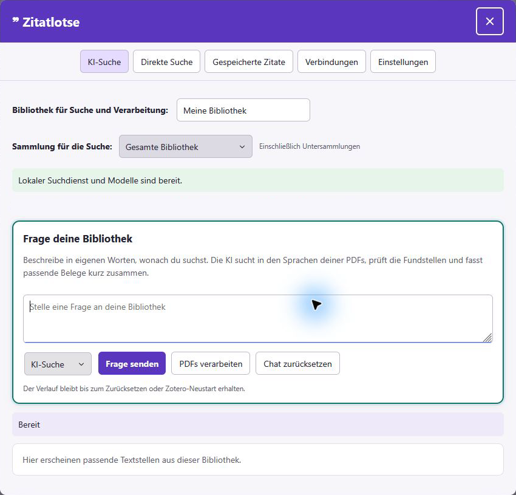
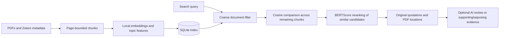

<p align="center"></p>

# Zitatlotse

**Your library. Your models. Evidence inside Zotero.**

Zitatlotse searches your PDF library for original passages and helps you check claims against supporting and opposing evidence. You choose the embedding model and AI provider. With Ollama, AI requests can stay local.

**Zotero 10 · Windows x64 · Version 0.27.0 · Experimental prototype · MIT for original project code**



**Actual Zotero UI:** See [all menus in the screenshot gallery](docs/SCREENSHOTS.md): AI Search, evidence mode, Direct Search, Saved Quotes, Connections and Settings, including custom Hugging Face models. These are captures of the installed add-on in Zotero, cropped and redacted for privacy. The captured interface follows Zotero's German locale; this documentation is in English.

[Features](docs/FEATURES.md) · [Installation](docs/INSTALLATION.md) · [Workflows](docs/WORKFLOWS.md) · [Architecture](docs/ARCHITECTURE.md) · [Test status and limitations](docs/STATUS.md) · [Data and privacy](docs/DATA.md)

## What you can do

| Feature | What it does |
| --- | --- |
| **Direct search** | Search locally for terms, questions and passages without calling an AI provider. |
| **AI search** | Ask in your own words; the AI formulates queries for the languages in your PDFs and summarizes relevant original passages with citations. |
| **Multi-step search** | A compatible model can make real tool calls to search again and refine its queries. Configure the step limit and activity view. |
| **Find evidence** | Enter a claim and compare retrieved passages as supporting, opposing or neutral. |
| **Document relevance** | See which processed documents contain passages similar to your current query in an animated ring chart. |
| **Libraries and collections** | Restrict a search to one library or collection, including subcollections. |
| **Open the source passage** | Jump to the PDF page and, when coordinates are available, highlight the passage. |
| **Save quotations** | Save, search, annotate, reopen and copy quotations. |
| **Choose a citation style** | Use installed Zotero CSL styles for citations with a PDF page locator. |
| **Choose your models** | Select from nine built-in embedding profiles or compatible Hugging Face models; confirm before rebuilding the index. |
| **Choose an AI provider** | Connect OpenAI, Anthropic, DeepSeek or Ollama; load available models or enter a model identifier. |
| **Work inside Zotero** | Use the purple sidebar entry, item-level processing, progress indicators and a menu language that follows Zotero's locale. |

The workflow connects research to the source: **question → original evidence → PDF passage → saved quotation with note and citation style**.

## Quick start on Windows

Requirements: **Zotero 10 on Windows x64**, locally available PDFs with extractable text, and enough disk space for the runtime and model weights. The release XPI includes Python and the required libraries.

1. Download **Zitatlotse-0.27.0.xpi** [directly](https://github.com/Cuzimnero/zitatlotse/releases/download/v0.27.0/Zitatlotse-0.27.0.xpi) or from the [experimental release](https://github.com/Cuzimnero/zitatlotse/releases/tag/v0.27.0). The repository and downloads are public; no GitHub account is required.
2. In Zotero, choose **Tools → Add-ons → Install Add-on From File**, select the XPI and restart Zotero.
3. Zotero sets up the bundled local search service and shows setup progress. No separate installer, Python installation or manual service launch is needed.
4. Select a PDF or library item and choose **Process this PDF** or **Process this item** in the right sidebar. On first use, the selected search models are downloaded. Choose **Process all new or changed PDFs** to index the library.
5. Open the purple Zitatlotse button. Select a library and, if needed, a collection. Search directly or configure an AI provider under **Connections**.

The XPI is larger than a UI-only add-on because it includes a CPU runtime. See the [installation guide](docs/INSTALLATION.md) for updates, model storage and troubleshooting.

## How search works



- **Chunks:** at most 100 words with up to 20 words of overlap, preferably split at sentence boundaries. A chunk never crosses a PDF page.
- **Topic features:** up to 16 local features from content words, word pairs and the title, plus a topic vector based on chunk embeddings. No LLM is required.
- **Prefilter:** for larger libraries, the topic filter removes only very unlikely documents. Search then compares the query with every chunk in the remaining documents.
- **Reranking:** candidates near the best cosine score are reranked with BERTScore. Short literal queries are case-insensitive, and overlapping passages are deduplicated.
- **AI:** formulates query variants for document languages, reviews retrieved original passages and cites validated locations. If the evidence is insufficient, no quotations should be marked as selected.

See the [architecture](docs/ARCHITECTURE.md) for thresholds, storage and components, and [workflows](docs/WORKFLOWS.md) for each user flow.

## What the charts mean

**Document relevance:** each document's score is the highest cosine similarity between the query and any of its chunks. Color groups divide the score range observed in that search. The percentage is the **share of documents in a group**, not a similarity score or probability. Identical indexed PDF content is grouped.

**Supporting/opposing evidence bar:** six supporting and four opposing passages yield 60% green and 40% red. Neutral passages are counted separately. This represents retrieved passages, **not** the probability that a claim is true or a rating of study quality.

## Local processing and your own API

PDF processing, embeddings, BERTScore, the index and saved quotations stay local. There is no Zitatlotse account, subscription or project-operated search server.

When you choose **OpenAI, Anthropic or DeepSeek**, your question and retrieved passages are sent to that provider. Multi-step searches may cause additional API charges. **Ollama** supports local AI requests; its models must be installed. Provider model lists show models available from that provider or installed in Ollama.

API keys are stored with `keyring` in the operating system's credential store. The database is a local SQLite file and is not additionally encrypted by Zitatlotse. See [data and privacy](docs/DATA.md).

## Current status

**Experimental prototype with known limitations.** Search quality and model selection need further evaluation across larger and more varied libraries.

- Version 0.27.0 starts and repairs the service through Zotero. A 30-second check is intended to recover from complete process loss. The earlier Windows task startup had a known recovery gap; a real PC reboot still needs separate testing.
- In a local test, the first real search after a process restart took about 83 seconds. A reachable service does not mean the models are already loaded.
- Vector comparison is an exact scan; there is no ANN index for very large libraries yet.
- Scanned PDFs need OCR beforehand. PDF page numbers may differ from printed page numbers.
- Exact passage highlighting depends on PDF text extraction; otherwise the correct PDF page is opened.
- The add-on includes German and English UI strings. Other Zotero locales use the English UI.
- There is no automatic XPI update. The native Zotero UI and a real Windows reboot still need manual testing.

See [test status, open issues and next steps](docs/STATUS.md).

## Development

```powershell
python -m pip install -r requirements-dev.txt
python -m unittest discover -s backend -p "test_*.py"
node test_plugin.js
node test_search_session.js
node test_runtime.js
python build_runtime.py
python package.py
```

The automated suite uses synthetic data and simulated provider responses. Optional tests with real models and providers are documented separately and are not run automatically by CI. See [contributing](CONTRIBUTING.md) and [testing](docs/TESTING.md).

## License and third-party projects

Original project code is licensed under the [MIT License](LICENSE). Dependencies and model weights retain their own licenses. In particular, PyMuPDF is offered under AGPL or commercial terms; MIT does not replace those obligations. See [dependencies and licenses](THIRD_PARTY.md).

Zitatlotse uses Zotero, PyMuPDF, SentenceTransformers, Transformers, BERTScore, NumPy and keyring, among others. It is an independent project, not an official Zotero product.
