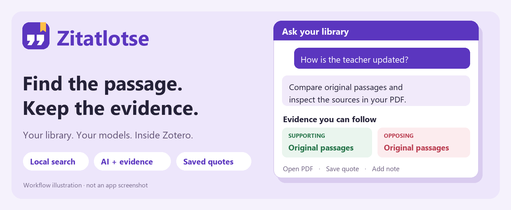
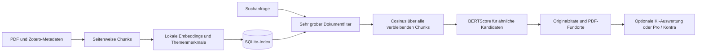

<p align="center"></p>

# Zitatlotse

**Deine Literatur. Deine Modelle. Belege direkt in Zotero.**

Zitatlotse durchsucht deine PDF-Bibliothek, findet zitierbare Originalstellen und hilft dabei, Aussagen mit Pro- und Kontra-Belegen zu prüfen. Du entscheidest, welches Embedding-Modell und welcher KI-Anbieter verwendet werden. Mit Ollama bleiben auch die KI-Aufrufe lokal.

**Zotero 10 · Windows · Version 0.26.3 · Experimenteller Prototyp · MIT für den eigenen Quellcode**



*Die Grafik illustriert den Arbeitsablauf; sie ist kein Screenshot der Erweiterung.*

[Alle Funktionen](docs/FEATURES.md) · [Installation](docs/INSTALLATION.md) · [Abläufe](docs/WORKFLOWS.md) · [Architektur](docs/ARCHITECTURE.md) · [Teststand & Grenzen](docs/STATUS.md) · [English](README.en.md)

## Was du damit machen kannst

| Funktion | Nutzen |
| --- | --- |
| **Direkte Suche** | Begriffe, Fragen und Textstellen lokal suchen, ohne einen KI-Anbieter aufzurufen. |
| **KI-Suche** | In eigenen Worten fragen; die KI formuliert Suchanfragen für die Dokumentsprachen und fasst passende Originalstellen mit Quellenverweisen zusammen. |
| **Mehrstufige Suche** | Ein unterstütztes Modell kann mit echten Tool Calls nachsuchen und Suchanfragen verfeinern. Schrittlimit und Aktivitätsanzeige sind einstellbar. |
| **Belege suchen** | Eine Aussage eingeben und gefundene Textstellen als Pro, Kontra oder neutral gegenüberstellen lassen. |
| **Dokumentrelevanz** | Im animierten Ringdiagramm sehen, welche verarbeiteten Dokumente zur aktuellen Frage ähnliche Textstellen enthalten. |
| **Bibliotheken & Sammlungen** | Suche auf genau eine Bibliothek oder eine Sammlung einschließlich Untersammlungen begrenzen. |
| **Originalstelle öffnen** | Per Doppelklick oder Schaltfläche zur PDF-Seite und möglichst zur hervorgehobenen Textstelle springen. |
| **Zitate sammeln** | Zitate dauerhaft speichern, durchsuchen, mit Notizen versehen, erneut öffnen und kopieren. |
| **Zitierstil wählen** | Installierte Zotero-CSL-Stile für den Kurzbeleg mit PDF-Seitenlocator verwenden. |
| **Modelle selbst wählen** | Neun integrierte Embedding-Profile sowie kompatible eigene Hugging-Face-Modelle; Modellwechsel mit bestätigtem Neuaufbau des Index. |
| **Anbieter selbst wählen** | OpenAI, Anthropic, DeepSeek oder Ollama verbinden; verfügbare Modelle laden oder eine Modellkennung eintragen. |
| **In Zotero arbeiten** | Violetter Einstieg rechts, Menüleiste, Verarbeitung beim gewählten Eintrag, Deutsch/Englisch nach Zotero-Sprache, animierte Fortschrittsanzeigen. |

Die Erweiterung verbindet die Suche mit deinem Literatur-Workflow: **Frage → Originalbeleg → PDF-Fundstelle → gespeichertes Zitat mit Notiz und Zitierstil**.

## Schnellstart unter Windows

Voraussetzungen: **Zotero 10**, **Python 3.10 oder neuer**, lokal verfügbare PDFs mit extrahierbarem Text und Platz für Modellgewichte. Modelle und Python-Pakete werden bei Bedarf heruntergeladen.

1. Dieses Repository klonen oder das vollständige Quellcode-Archiv entpacken.
2. Im Projektordner den lokalen Suchdienst installieren:

   ```powershell
   powershell -NoProfile -ExecutionPolicy Bypass -File .\Install-Zitatlotse.ps1
   ```

3. Die Erweiterungsdatei bauen:

   ```powershell
   python package.py
   ```

4. In Zotero unter **Werkzeuge → Add-ons → Add-on aus Datei installieren** die Datei `dist\Zitatlotse-0.26.3.xpi` wählen und Zotero neu starten.
5. Eine PDF oder einen Literatur-Eintrag auswählen und rechts **Diese PDF verarbeiten** beziehungsweise **Diesen Eintrag verarbeiten** anklicken. Mit **Alle neuen/geänderten PDFs verarbeiten** die Bibliothek ergänzen.
6. Das violette Zitatlotse-Symbol anklicken. Bibliothek und gegebenenfalls Sammlung wählen; direkt suchen oder unter **Verbindungen** einen KI-Anbieter einrichten.

Bei vorhandenen Release-Dateien kann Schritt 3 durch die bereitgestellte XPI ersetzt werden. Ausführliche Hinweise zu Updates, Modellcache und Fehlerdiagnose stehen in der [Installationsanleitung](docs/INSTALLATION.md).

## So funktioniert die Suche



- **Chunks:** maximal 100 Wörter, bis zu 20 Wörter Überlappung, möglichst an Satzgrenzen. Ein Chunk bleibt innerhalb einer PDF-Seite.
- **Themenmerkmale:** bis zu 16 lokale Merkmale aus Inhaltswörtern, Wortpaaren und Titel; zusätzlich ein Themenvektor aus Chunk-Embeddings. Dafür wird kein LLM benötigt.
- **Vorauswahl:** Bei größeren Bibliotheken entfernt der Themenfilter nur besonders unwahrscheinliche Dokumente. Danach werden alle Chunks der verbliebenen Dokumente mit der Suchanfrage verglichen.
- **Reranking:** Nahe am besten Cosinus-Wert liegende Kandidaten werden mit BERTScore nachbewertet. Kurze wörtliche Anfragen werden unabhängig von Groß- und Kleinschreibung behandelt; Überlappungen werden bereinigt.
- **KI:** Erzeugt Suchvarianten für die Dokumentsprachen, bewertet abgerufene Originalstellen und referenziert geprüfte Fundstellen. Ohne tragfähige Belege sollen keine Zitate als ausgewählt erscheinen.

Die [Architektur](docs/ARCHITECTURE.md) beschreibt Schwellenwerte, Datenspeicherung und Komponenten; die [Abläufe](docs/WORKFLOWS.md) erklären die einzelnen Nutzungssituationen.

## Was die Diagramme aussagen

**Dokumentrelevanz:** Der Wert eines Dokuments ist die höchste Cosinus-Ähnlichkeit eines seiner Chunks zur jeweiligen Suchanfrage. Die Farbgruppen teilen das beobachtete Spektrum dieser Suche ein. Die Prozentzahl am Gruppennamen ist der **Anteil der Dokumente in dieser Gruppe**, kein Ähnlichkeitswert und keine Wahrscheinlichkeit. Identische indizierte PDF-Inhalte werden zusammengefasst.

**Pro-/Kontra-Balken:** Sechs Pro- und vier Kontra-Stellen ergeben 60 % grün und 40 % rot. Neutrale Stellen werden separat gezählt. Das beschreibt gefundene Textstellen, **nicht** die Wahrscheinlichkeit, dass die Aussage wahr ist, und keine Gewichtung der Studienqualität.

## Lokal arbeiten oder eigene API verwenden

PDF-Auswertung, Embeddings, BERTScore, Index und gespeicherte Zitate liegen lokal. Es gibt keinen Zitatlotse-Account, kein Abonnement und keinen von diesem Projekt betriebenen Suchserver.

Bei Auswahl von **OpenAI, Anthropic oder DeepSeek** werden die Frage und abgerufene Textstellen an den gewählten Anbieter gesendet. Mehrere Suchschritte können weitere API-Kosten verursachen. **Ollama** ermöglicht lokale KI-Abfragen; Modelle müssen dort installiert sein. Die Modelllisten zeigen die beim jeweiligen Anbieter verfügbaren beziehungsweise installierten Modelle.

API-Schlüssel werden über `keyring` im Anmeldeinformationsspeicher des Betriebssystems abgelegt. Die Datenbank ist eine lokale SQLite-Datei und wird von Zitatlotse nicht zusätzlich verschlüsselt. Details: [Daten & Datenschutz](docs/DATA.md).

## Aktueller Stand

**Experimenteller Prototyp mit bekannten Einschränkungen.** Die Suche und Modellwahl brauchen weitere Evaluation mit größeren und vielfältigeren Beständen.

- Windows-Kaltstarts, Start aus dem Menü und Worker-Wiederanlauf wurden geprüft. **Nach vollständigem Ausfall von Supervisor und Worker erfolgte im Test innerhalb von 100 Sekunden kein automatischer Wiederanlauf durch Windows.**
- Die erste echte Suche nach einem Prozessneustart dauerte im lokalen Test etwa 83 Sekunden. Ein erreichbarer Dienst bedeutet nicht, dass die Modelle schon geladen sind.
- Der Vektorvergleich ist ein exakter Scan; noch kein ANN-Index für sehr große Bibliotheken.
- Gescannte PDFs benötigen vorher OCR. PDF-Seiten und gedruckte Seitenzahlen können voneinander abweichen.
- Der Sprung zur exakten Textstelle hängt von der PDF-Texterkennung ab; andernfalls wird die richtige PDF-Seite geöffnet.
- Nur Deutsch und Englisch sind als Oberflächensprachen enthalten. Andere Zotero-Sprachen verwenden die englische Oberfläche.
- Keine automatische Aktualisierung der XPI. Die native Zotero-Oberfläche und ein echter Windows-Neustart müssen zusätzlich manuell geprüft werden.

[Teststand, offene Punkte und Verbesserungsvorschläge](docs/STATUS.md)

## Entwickeln und mithelfen

```powershell
python -m pip install -r requirements-dev.txt
python -m unittest discover -s backend -p "test_*.py"
node test_plugin.js
node test_search_session.js
python package.py
```

Die automatisierte Testsuite nutzt synthetische Daten und simulierte Anbieterantworten. Optionale Tests mit echten Modellen und Anbietern sind gesondert beschrieben und werden nicht automatisch von CI ausgeführt. [Mitwirken](CONTRIBUTING.md) · [Tests](docs/TESTING.md)

## Lizenz und verwendete Projekte

Der eigene Quellcode steht unter der [MIT-Lizenz](LICENSE). Abhängigkeiten und Modellgewichte behalten ihre eigenen Lizenzen. Insbesondere wird PyMuPDF unter AGPL oder kommerzieller Lizenz angeboten; MIT hebt diese Bedingungen nicht auf. Siehe [Abhängigkeiten & Lizenzen](THIRD_PARTY.md).

Zitatlotse verwendet unter anderem Zotero, PyMuPDF, SentenceTransformers, Transformers, BERTScore, NumPy und keyring. Danke an die Entwickler dieser Projekte. Das Add-on ist ein unabhängiges Projekt und kein offizielles Zotero-Produkt.
