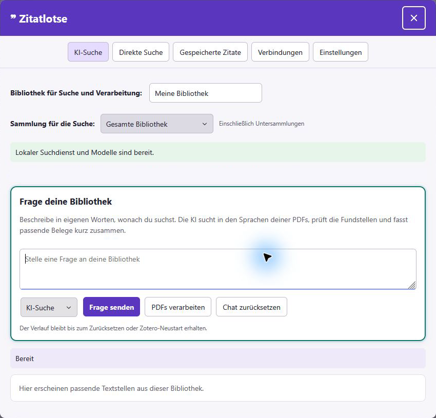

# Zitatlotse

**Your library. Your models. Evidence inside Zotero.**

Find original passages, compare supporting and opposing evidence, and save quotations directly in Zotero.

**Zotero 10 · Windows x64 · v0.30.0 · Experimental · MIT project code**

[Download XPI](https://github.com/Cuzimnero/zitatlotse/releases/download/v0.30.0/Zitatlotse-0.30.0.xpi) · [Release](https://github.com/Cuzimnero/zitatlotse/releases/tag/v0.30.0) · [All features](docs/FEATURES.md)

[All menus](docs/SCREENSHOTS.md) — actual Zotero screenshots of an earlier theme, cropped for privacy.

## Features

- Local direct search, multilingual AI search and optional tool-based follow-up searches.
- Supporting/opposing evidence with source references and passage counts.
- PDF jumps and passage highlighting; saved quotations, notes and Zotero citation styles.
- Library/collection filters and a document relevance chart.
- Built-in or compatible Hugging Face embeddings; OpenAI, Anthropic, DeepSeek or local Ollama.
- Normal mode with BERTScore, Fast mode without it, and optional search acceleration.
- German/English interface following Zotero's language.

## Install

1. Download the XPI above.
2. In Zotero: **Tools → Add-ons → Install Add-on From File**, then restart.
3. Process a PDF or choose **Process all new or changed PDFs**.
4. Open the purple sidebar button. Configure an AI provider under **Connections** if needed.

The XPI includes the Windows Python runtime. Search models download on first use. Existing indexes and saved quotations survive updates.

## New in 0.30.0

Earlier results, fewer AI calls and reusable vector caches. Acceleration is enabled by default; compare workflows under **Settings → Search speed → Try search acceleration**. Initial results are provisional; full evidence assessment still checks every retrieved passage. [Details](docs/PERFORMANCE-EXPERIMENT.md).

## Notes

Cloud providers receive the question and retrieved passages; Ollama can keep AI requests local. Search quality, cold starts and large-library performance still need evaluation. Scanned PDFs require OCR. Automatic add-on updates are disabled.

[Installation](docs/INSTALLATION.md) · [Workflows](docs/WORKFLOWS.md) · [Architecture](docs/ARCHITECTURE.md) · [Tests](docs/STATUS.md) · [Privacy](docs/DATA.md) · [Contributing](CONTRIBUTING.md)

Original code: [MIT](LICENSE). Dependencies and models retain their own licenses; see [third-party notices](THIRD_PARTY.md).
