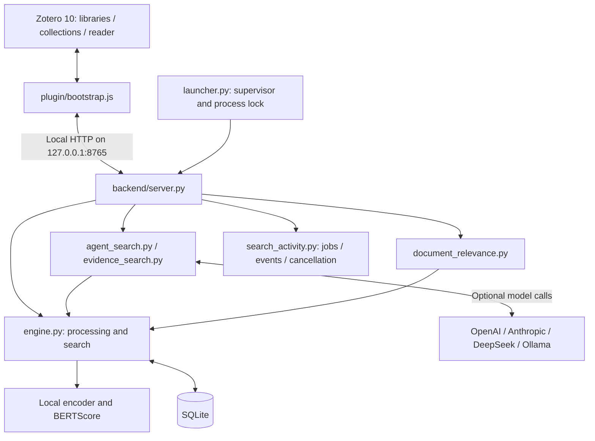

# Architecture

[Project page](../README.md) · [User workflows](WORKFLOWS.md)

## Components



## Files and responsibilities

| File | Responsibility |
| --- | --- |
| `plugin/bootstrap.js` | Zotero integration, processing, search scope, UI, reader, citation style, temporary sessions and startup requests. |
| `backend/server.py` | Local HTTP endpoints, provider requests, one-step AI search and connection tests. |
| `backend/launcher.py` | Instance lock, logging, worker startup and recovery. |
| `backend/engine.py` | SQLite, PDF text, chunks, topic features, language estimation, cosine, BERTScore, search state and saved quotations. |
| `backend/embedding_models.py` | Model profiles, custom Hugging Face models, input prefixes, compatibility checks and atomic rebuilds. |
| `backend/provider_models.py` | Model catalogs and suggestions for each AI provider. |
| `backend/agent_search.py` | Multi-step search loop, tools, budgets, reference validation and fallbacks. |
| `backend/evidence_search.py` | Evidence searches, supporting/opposing/neutral review and tally. |
| `backend/document_relevance.py` | Highest chunk score per document, content deduplication and relative groups. |
| `backend/search_scope.py` | Validation and comparison of the fixed library/file selection. |
| `backend/search_activity.py` | Asynchronous search jobs, events, status queries and cancellation. |
| `backend/settings.py` | Configuration and API keys through the OS credential store. |

## Processing and storage

The plugin receives selected attachments and metadata from Zotero. The local service reads the PDF through its local path. It does not write directly to Zotero's database.

PDF text is normalized page by page and split into overlapping passages: up to 100 words with up to 20 words of overlap. Each chunk stores its library, attachment, page, order, text and embedding. PDF locations are resolved from text and coordinates when possible.

Important content terms, word pairs and the title provide up to 16 topic features. The topic vector is the normalized mean of chunk vectors. Normalized chunk vectors are stored in a compact binary format in SQLite; older JSON vectors are migrated when needed.

The main tables are `documents`, `chunks`, `saved_quotes` and `index_metadata`. Library IDs remain part of the mapping even when two libraries contain identical attachment IDs. The model ID and configuration are stored with the index so that query and document vectors stay compatible.

## Local search stages

1. **Set scope:** one library ID and optionally a fixed attachment list for a collection. An empty list stays empty.
2. **Coarse document filter:** for larger libraries, remove documents that appear especially distant. At least 85% are generally retained; matching topic features may retain additional documents. Short single-term queries bypass this exclusion.
3. **Cosine:** compare the query with every chunk in the remaining documents. Pass candidates within 0.06 of the best direct-search score to the next stage. Handle multilingual and AI query variants so that a stronger variant does not displace a suitable result from another variant.
4. **BERTScore:** rerank all qualifying candidates in bounded batches. The combined ordering uses 65% BERTScore and 35% cosine.
5. **Validate and deduplicate:** apply relevance thresholds, literal-query cases and model-specific rules; remove repeated original passages. A matching short literal query should retain distinct real occurrences.
6. **Paginate:** store verified results and search state; show at most 20 quotations per UI page. Search states expire after 900 seconds.

AI and evidence searches intentionally use broader candidate rules so the following model review can assess more aspects. For example, these flows allow a larger cosine range of 0.15. Those candidates are not yet quotations selected as reliable evidence. Model families may need their own minimum scores.

All values are current implementation parameters, not universal relevance calibration. Changes must be tested with positive queries, unrelated negative cases and scope boundaries.

## AI and evidence layer

One-step AI search formulates query variants in document languages, uses the local search flow and reviews a limited set of original passages. Multi-step search lets a model make real `search_library` calls. Each step can include up to eight original passages from retrieved candidates in the model context. `finish_search` refers to validated sources.

The service enforces the step limit, reuse of identical queries, reference validation, fixed scope and a time budget. The AI cannot expand the scope on its own. If tool calls are unavailable or invalid, the service falls back to one-step search with a notice.

Evidence mode additionally classifies retrieved candidates as supporting, opposing or neutral/unclear, and as direct evidence or a related aspect. The tally is based on the number of passages assigned to each group.

## Document chart

For each processed document in scope:

```text
document_score = max(cosine(query_variant, chunk) for all chunks in the document)
```

The score is calculated independently of quotation filters, coarse topic prefiltering and AI selection. Available language-specific query variants are reused. Identical indexed content is grouped using text/page/chunk fingerprints. The best matching passage determines the score and suggested PDF location.

The observed score range is split into relative groups. Group shares count documents; they are not cosine values. Equal or missing values are handled separately.

## Changing models

A new model or input configuration requires new chunk and topic vectors. After confirmation, the vectors are calculated for every library in a separate staging area. They are activated in a transaction only after the rebuild succeeds. The old index remains usable until then and stays active if the rebuild fails. Text, quotations and notes are preserved.

## Windows startup

The release XPI contains the embedded Windows x64 Python runtime, CPU libraries, backend and `runtime/setup.ps1`. Zotero extracts the package under `%USERPROFILE%\.zitatlotse`, verifies SHA-256 and imports, then starts the absolute Python/launcher path automatically. The launcher uses an OS file lock to prevent parallel supervisors and restarts a crashed search worker with bounded increasing delays.

Zotero starts the service when the add-on loads, the window opens or the connection is lost. A 30-second check also detects loss of the whole process tree. The standard XPI installation needs no Windows task or preinstalled Python. HTTP availability and full model readiness are separate states. See [installation](INSTALLATION.md) and [test status](STATUS.md).

## Scaling

Cosine comparison is still an exact vector scan; its cost grows with the number of chunks considered. BERTScore is significantly more expensive, so it runs only after cosine selection. An ANN index, better batching/cache strategies and validated relevance thresholds are possible next steps, not completed features.
