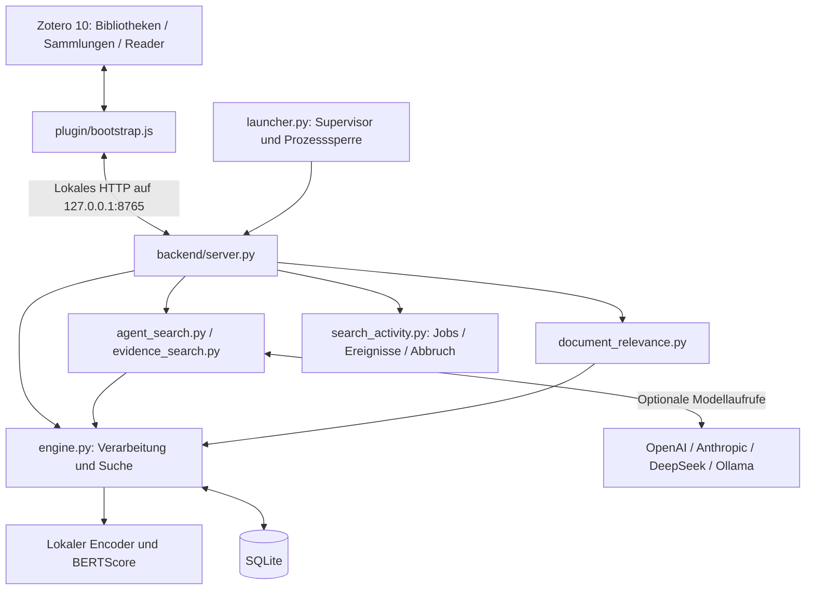

# Architektur

[Zur Projektseite](../README.md) · [Nutzungsabläufe](WORKFLOWS.md)

## Komponenten



## Dateien und Zuständigkeiten

| Datei | Aufgabe |
| --- | --- |
| `plugin/bootstrap.js` | Zotero-Integration, Verarbeitung, Suchbereich, Oberfläche, Reader, Zitierstil, temporäre Sitzungen, Startanforderung. |
| `backend/server.py` | Lokale HTTP-Endpunkte, Anbieteranfragen, einstufige KI-Suche und Verbindungstest. |
| `backend/launcher.py` | Instanzsperre, Protokollierung, Worker-Start und Wiederanlauf. |
| `backend/engine.py` | SQLite, PDF-Text, Chunks, Themenmerkmale, Sprachschätzung, Cosinus, BERTScore, Suchstände und gespeicherte Zitate. |
| `backend/embedding_models.py` | Modellprofile, eigene Hugging-Face-Modelle, Eingabepräfixe, Kompatibilitätsprüfung und atomarer Neuaufbau. |
| `backend/provider_models.py` | Modellkataloge und Vorschläge pro KI-Anbieter. |
| `backend/agent_search.py` | Mehrstufige Suchschleife, Werkzeuge, Budgets, Referenzprüfung und Rückfälle. |
| `backend/evidence_search.py` | Belegsuchen, Pro-/Kontra-/Neutral-Bewertung und Bilanz. |
| `backend/document_relevance.py` | Maximaler Chunk-Wert je Dokument, Inhaltsduplikate und relative Kategorien. |
| `backend/search_scope.py` | Validierung und Vergleich der festgelegten Bibliotheks-/Dateiauswahl. |
| `backend/search_activity.py` | Asynchrone Suchjobs, Ereignisse, Statusabfrage und Abbruch. |
| `backend/settings.py` | Konfiguration und API-Schlüssel über den OS-Speicher. |

## Verarbeitung und Speicher

Der Plugin-Code erhält die ausgewählten Anhänge und Metadaten über Zotero. Der lokale Dienst liest die PDF-Datei über deren lokalen Pfad. Es gibt keinen direkten Schreibzugriff auf Zoteros eigene Datenbank.

PDF-Text wird pro Seite normalisiert und in überlappende Abschnitte zerlegt: maximal 100 Wörter, bis zu 20 Wörter Überlappung. Pro Chunk werden Bibliothek, Anhang, Seite, Reihenfolge, Text und Embedding gespeichert. Der PDF-Fundort wird bei Bedarf über Texterkennung und Koordinaten aufgelöst.

Die wichtigsten Inhaltsbegriffe, Wortpaare und der Titel liefern bis zu 16 Themenmerkmale. Der Themenvektor ist der normalisierte Mittelwert der Chunk-Vektoren. Normalisierte Chunk-Vektoren liegen in einem kompakten Binärformat in SQLite; frühere JSON-Vektoren werden bei Bedarf migriert.

Die zentralen Tabellen sind `documents`, `chunks`, `saved_quotes` und `index_metadata`. Bibliothekskennungen bleiben auch dann Teil der Zuordnung, wenn zwei Bibliotheken identische Anhangskennungen enthalten. Modellkennung und Konfiguration gehören zum Index, damit Query und gespeicherte Vektoren zusammenpassen.

## Stufen der lokalen Suche

1. **Bereich festlegen:** eine Bibliothekskennung und optional eine feste Anhangsliste der Sammlung. Eine leere Liste bleibt leer.
2. **Grober Dokumentfilter:** bei größeren Beständen besonders weit entfernte Dokumente entfernen. Mindestens 85 % bleiben grundsätzlich erhalten; passende Themenmerkmale können weitere Dokumente erhalten. Kurze Einzelbegriffe umgehen diesen Ausschluss.
3. **Cosinus:** Query gegen jeden Chunk der verbliebenen Dokumente berechnen. Kandidaten innerhalb von 0,06 zum besten Wert der direkten Suche weitergeben. Mehrsprachige und KI-Varianten werden so behandelt, dass eine stärkere Variante eine passende andere Variante nicht verdrängt.
4. **BERTScore:** sämtliche qualifizierten Kandidaten in begrenzten Gruppen nachbewerten. Die kombinierte Sortierung verwendet 65 % BERTScore und 35 % Cosinus.
5. **Prüfen und bereinigen:** Relevanzschwellen, wörtliche Suchfälle und modellspezifische Regeln anwenden; wiederholte Originalstellen entfernen. Eine passende kurze wörtliche Anfrage erhält verschiedene tatsächliche Fundorte.
6. **Paginieren:** geprüfte Treffer und Suchzustand speichern; höchstens 20 Zitate je UI-Seite anzeigen. Suchstände laufen nach 900 Sekunden ab.

Für die KI-/Belegsuche gibt es bewusst breitere Kandidatenregeln, damit die nachfolgende Auswertung Aspekte bewerten kann. Dort ist unter anderem eine größere Cosinus-Spanne von 0,15 vorgesehen. Diese Kandidaten sind noch keine als belastbar ausgewählten Zitate. Modellfamilien können eigene Mindestwerte benötigen.

Alle Werte sind derzeit Implementierungsparameter, keine allgemeingültige Relevanzkalibrierung. Änderungen müssen mit positiven Fragen, fachfremden Negativfällen und Bereichsgrenzen getestet werden.

## KI- und Belegschicht

Einstufige KI-Suche formuliert Suchvarianten für die Dokumentsprachen, verwendet den lokalen Suchablauf und bewertet eine begrenzte Auswahl Originalstellen. Mehrstufige Suche lässt das Modell echte `search_library`-Aufrufe auslösen. Pro Suchschritt werden bis zu acht Originalstellen aus den abgerufenen Kandidaten in den Modellkontext aufgenommen. `finish_search` referenziert geprüfte Quellen.

Schrittlimit, Wiederverwendung gleicher Anfragen, Referenzvalidierung, feste Bereichsgrenzen und ein Zeitbudget werden im Dienst umgesetzt. Die KI kann den Bereich nicht eigenständig erweitern. Wenn Tool Calls fehlen oder ungültig sind, erfolgt ein gekennzeichneter Rückfall auf die einstufige Suche.

Der Belegmodus beurteilt die abgerufenen Kandidaten zusätzlich nach Pro, Kontra und neutral/unklar sowie direktem Beleg oder Teilaspekt. Die Bilanz basiert auf der Anzahl der so eingeordneten Stellen.

## Dokumentgrafik

Für jedes verarbeitete Dokument im Bereich gilt:

```text
document_score = max(cosine(query_variant, chunk) für die Chunks dieses Dokuments)
```

Der Wert wird unabhängig von Zitatfiltern, grober Themenvorauswahl und KI-Auswahl berechnet. Verfügbare sprachbezogene Suchvarianten werden wiederverwendet. Identische indizierte Inhalte werden anhand ihrer Text-/Seiten-/Chunk-Fingerabdrücke gruppiert. Die höchste passende Stelle bestimmt den Wert und den angebotenen PDF-Fundort.

Die beobachtete Wertespanne wird in relative Gruppen aufgeteilt. Die Gruppenanteile zählen Dokumente; sie sind keine numerischen Cosinus-Werte. Gleiche oder fehlende Werte werden gesondert behandelt.

## Modellwechsel

Ein neues Modell oder eine neue Eingabekonfiguration braucht neue Chunk- und Themenvektoren. Nach Bestätigung werden diese in einem separaten Staging-Bereich für alle Bibliotheken berechnet. Erst bei erfolgreichem Abschluss werden sie in einer Transaktion aktiviert. Der alte Index bleibt bis dahin verwendbar; bei einem Fehler bleibt er aktiv. Texte, Zitate und Notizen werden erhalten.

## Start unter Windows

Die Release-XPI enthält die eingebettete Windows-x64-Python-Laufzeit, CPU-Bibliotheken, Backend und `runtime/setup.ps1`. Zotero entpackt das Paket unter `%USERPROFILE%\.zitatlotse`, prüft SHA-256 und Imports und startet den absoluten Python-/Launcher-Pfad automatisch. Der Launcher verhindert parallele Supervisoren über eine Betriebssystem-Dateisperre und startet den Such-Worker mit begrenzter ansteigender Wartezeit erneut.

Zotero startet beim Laden des Add-ons, beim Öffnen des Fensters sowie bei Verbindungsverlust. Ein 30-Sekunden-Check fängt auch den Verlust des gesamten Prozessbaums auf. Die normale XPI-Installation braucht keine Windows-Aufgabe und kein installiertes Python. HTTP-Verfügbarkeit und vollständige Modellbereitschaft sind zwei verschiedene Zustände. Ablauf und Tests: [Installation](INSTALLATION.md), [Status](STATUS.md).

## Skalierung

Der Cosinus-Vergleich bleibt ein exakter Vektorscan. Sein Aufwand wächst mit der Zahl betrachteter Chunks. BERTScore ist deutlich teurer und wird daher erst nach der Cosinus-Auswahl verwendet. Ein ANN-Index, bessere Batch-/Cache-Strategien und überprüfte Relevanzschwellen sind mögliche nächste Schritte; sie sind noch nicht als fertige Funktionen enthalten.
