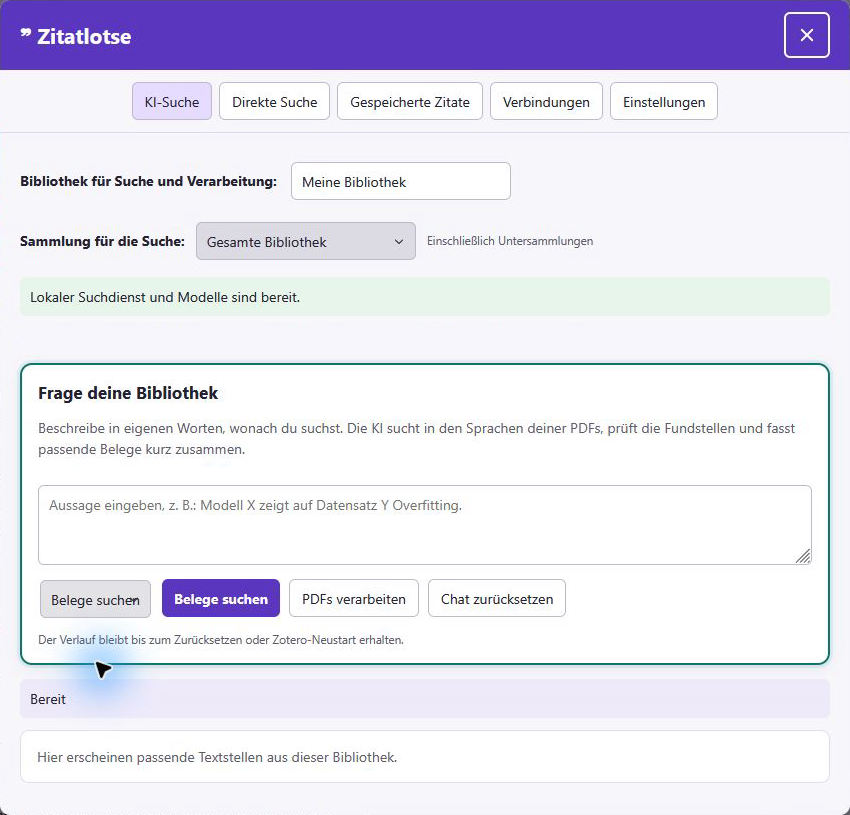
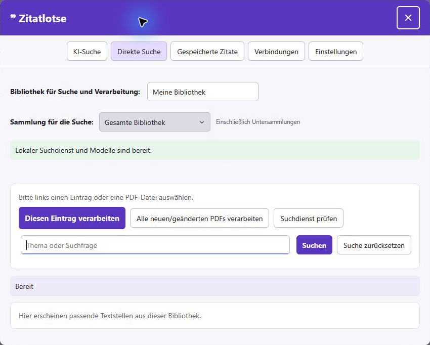
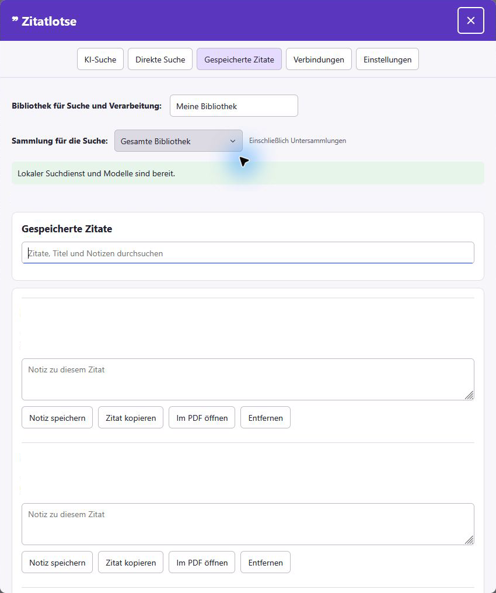
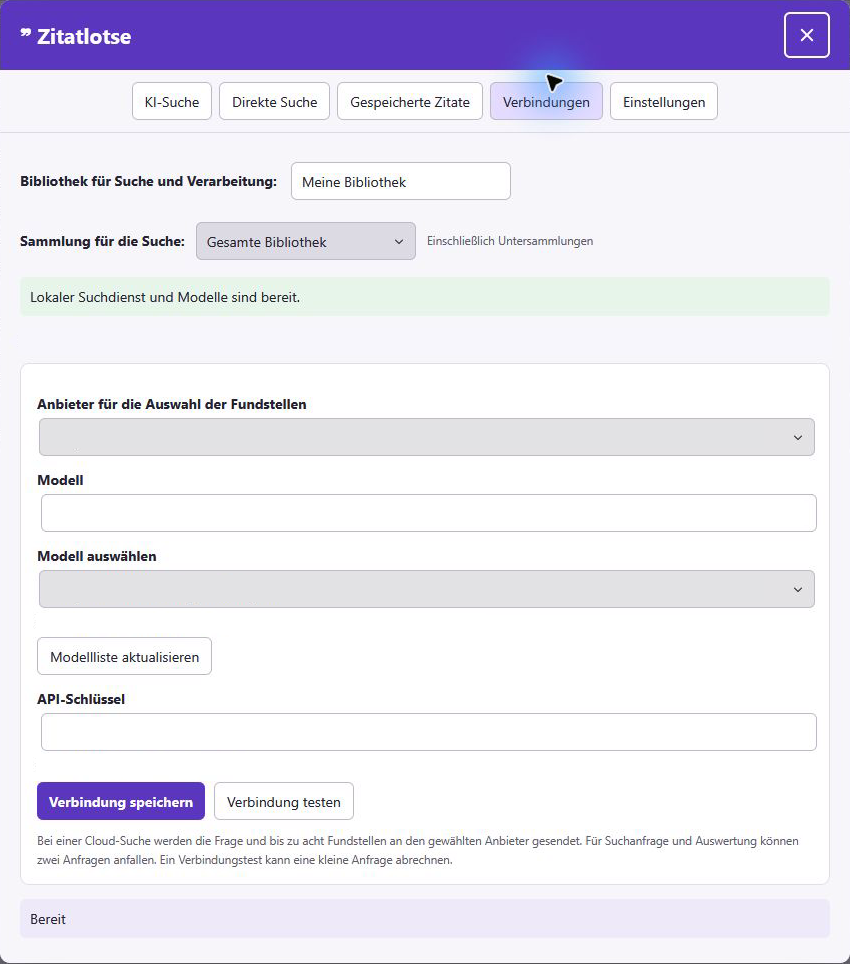
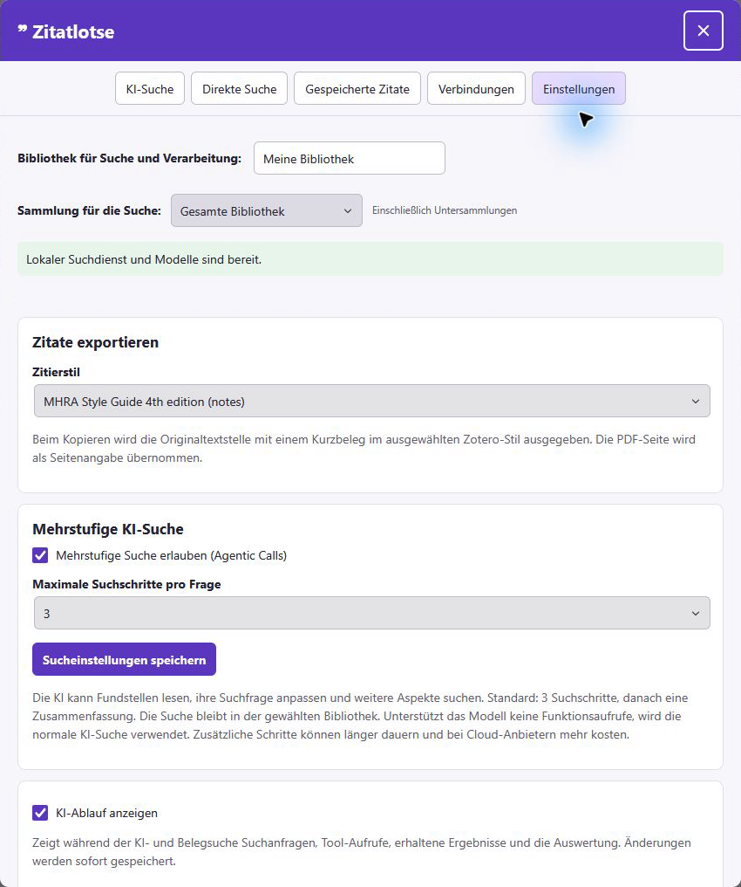
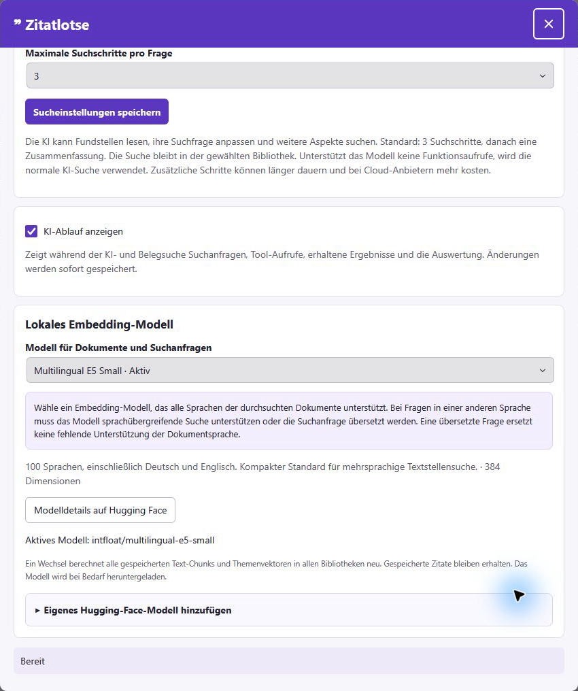
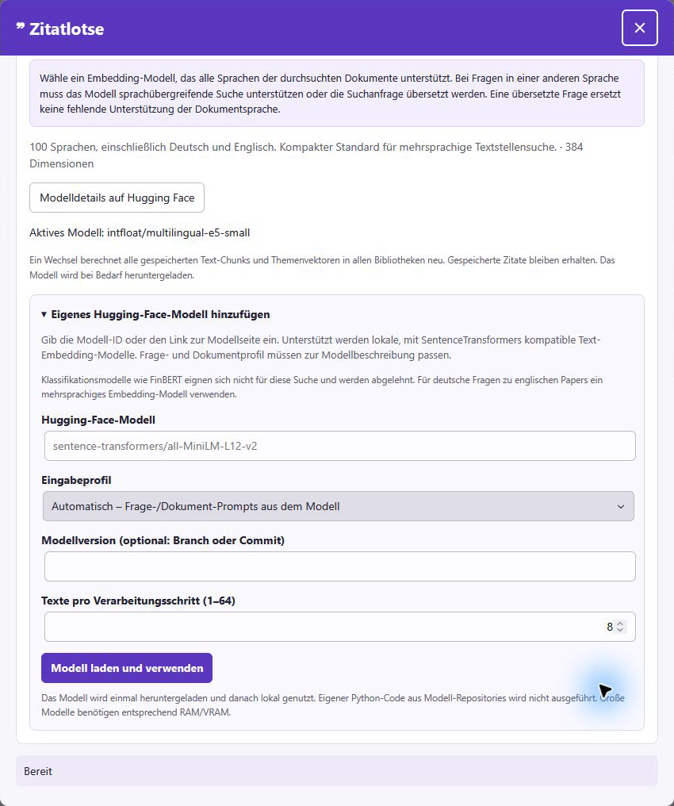

# Zotero UI screenshots

[Project page](../README.md)

These are genuine captures of the installed Zitatlotse add-on running inside Zotero on Windows, taken on October 9, 2026. They show all five main tabs, evidence mode and the additional embedding settings. No reconstructed interface is used.

The interface follows the active Zotero language, German in these captures. All explanations here are in English. Screenshots illustrate the installed interface; they are not a certification of the packaged release or search quality.

**Privacy:** Images are cropped to the add-on panel. Library statistics, saved quotation titles and passages, and configured connection values are covered with opaque masks. Blank areas in those locations are redactions, not empty application data. The surrounding Zotero library and PDF reader are excluded. No search was submitted to create these screenshots.

## AI Search

Ask a question in your own words, select the library and collection, and let the configured AI formulate search queries and review retrieved passages. The chat and result area are shown before a question is submitted.

## Find evidence

Select **Find evidence** in the chat mode selector and enter a claim. After a search, the add-on can group retrieved evidence as supporting, opposing or neutral. This screenshot shows the actual input mode before submission; it does not show a generated evidence result.

## Direct Search

Search without an AI provider, process the selected item or process all new and changed PDFs. Library and collection controls determine the search scope.

## Saved Quotes

Search saved quotations by passage, title or note. Each quotation has controls to save a note, copy the citation, open the PDF and remove the saved quotation. Source titles and quotation text are hidden in this capture; the actual controls remain visible.

## Connections

Choose OpenAI, Anthropic, DeepSeek or Ollama, load available models, and configure or test the connection. Selected provider and model values and credential status are hidden for privacy. No credentials or connection settings were changed for the capture.

## Settings

### Citations and multi-step search

Choose an installed Zotero citation style, enable agentic calls, limit search steps and control whether AI activity is shown.

### Local embedding model

Select the retrieval model, read its language and resource description and open its Hugging Face model page. Changing the model requires confirmation before rebuilding stored embeddings. This capture shows the settings after scrolling down; the header remains visible.

### Custom Hugging Face models

Expand the custom-model section to enter a compatible model repository, input profile, optional revision and processing batch size. The displayed repository is the built-in placeholder, not a newly loaded model. No model download or index rebuild was triggered for these screenshots.

