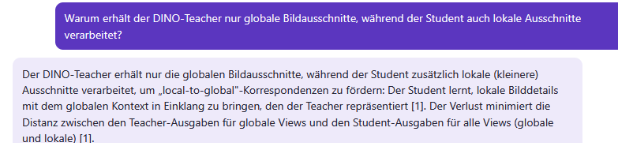
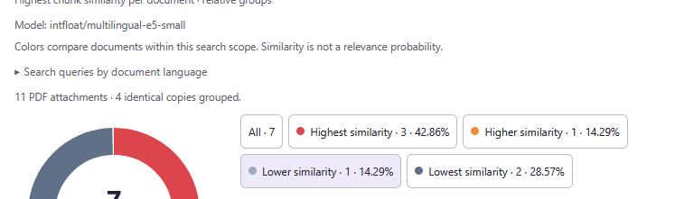

# Zotero UI screenshots

[Project page](../README.md)

These images are genuine crops from Zotero screenshots shared earlier. They are not recreated interfaces or generated mockups. They show earlier UI versions; version 0.27.0 mainly adds the complete runtime installer. A fresh, complete screenshot set for this release is still pending.

## AI chat

Ask in your own words and review the answer with source references. Open and save passages from the results below.

## Document overview

Groups use each document's highest chunk score. Percentages count the share of documents in each group; they are not probabilities of similarity.

These screenshots show examples from earlier searches and are not a quality claim about the retrieval pipeline. See the [feature catalog](FEATURES.md) for the complete interface and its behavior.
