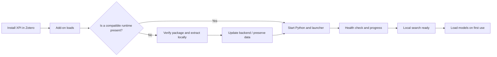
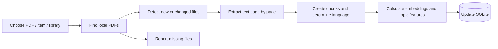
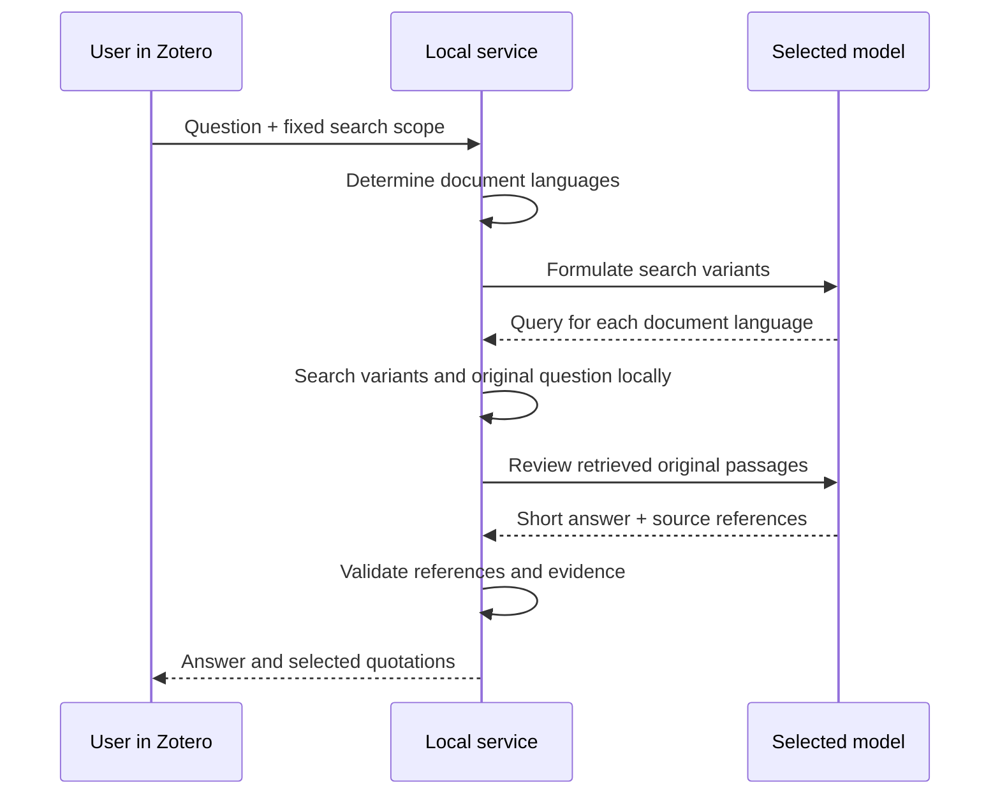
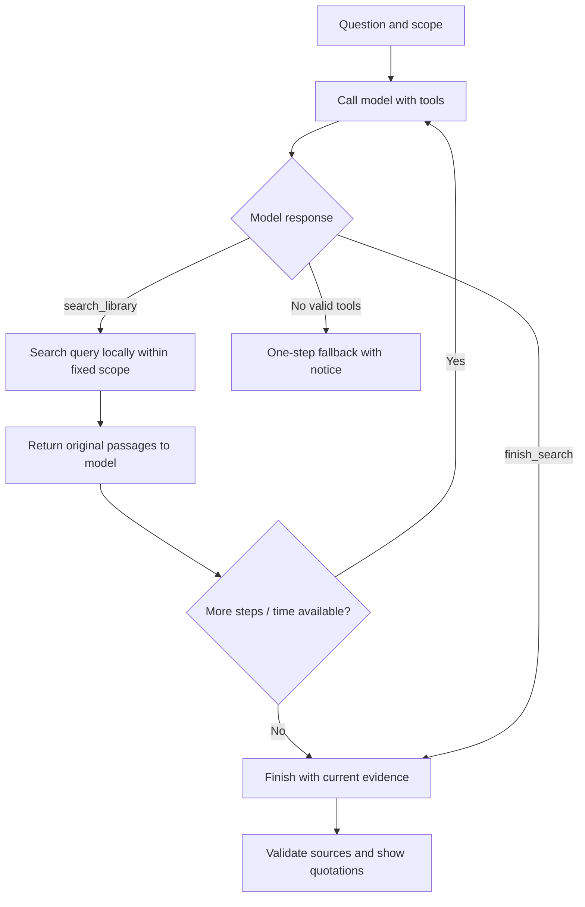
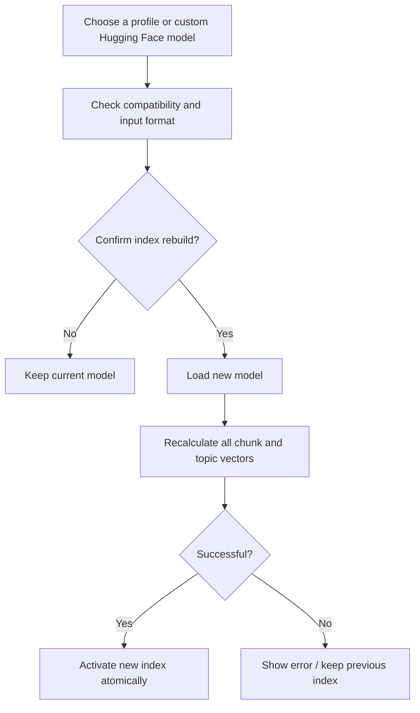

# User workflows

[Project page](../README.md) · [Technical architecture](ARCHITECTURE.md)

## Install and restart

The user does not start a separate program. After a PC restart, Zotero starts the service again. While Zotero is open, the add-on checks the service every 30 seconds. Setup errors appear in the search window and can be retried with **Check search service**.

## 1. Process a new PDF or library

**Input:** a Zotero library and a PDF, library item or library scan. **Output:** local chunks, vectors, metadata and a progress report.

For a library item, process its PDF attachments. A library scan reindexes only outdated attachments. The Zotero notifier can automatically queue new PDF attachments. Report files that are not available locally or cannot be read. Scanned PDFs with no text need OCR first.

## 2. Run a direct search

**Input:** query text and a library/collection scope.

1. Validate the scope. If the selected collection is empty, return no results.
2. Encode the query with the active local encoder.
3. Coarsely exclude only extremely unlikely documents.
4. Compare all remaining chunks using cosine similarity.
5. Rerank similar candidates with BERTScore.
6. Apply literal-query and relevance rules, then deduplicate overlaps.
7. Show paginated quotations with paper title and PDF page.

**Output:** original passages or an empty result. No AI provider is called. When the window closes, keep the query and results in the current Zotero session.

## 3. Run a one-step AI search

**Input:** a natural-language question. **Output:** a short answer and a source list. A German question can be turned into English search queries for English PDFs.

Keep the original question as a search variant. The AI receives a limited set of retrieved passages, not an automatic full reading of the library. If it finds insufficient evidence, no quotations remain selected. If a provider fails, show a notice and use stricter local search where possible.

## 4. Run a multi-step AI search

The model decides whether it needs another query. The service controls the scope, step count and source IDs. Identical repeated queries within one question are reused. The activity view can show the actual events.

**Cancellation:** resetting or changing the scope ends the active UI request; late results are discarded. A time budget cannot always immediately interrupt a local computation already in progress.

## 5. Check a claim using supporting and opposing evidence

**Input:** a concrete claim, for example, “Smaller image patches improve representation quality without additional compute.” This is an example input, not a guaranteed test question.

1. Search for supporting, opposing and relevant aspects of the claim.
2. Allow additional queries if multi-step search is enabled and supported.
3. Have the model assess candidates retrieved during the flow in limited groups.
4. Validate source references; classify evidence as supporting, opposing or neutral/unclear.
5. Show findings, reasons and original quotations with paper references.
6. Calculate the supporting/opposing shares as `supporting / (supporting + opposing)` and `opposing / (supporting + opposing)`. Show neutral passages separately.

**Output:** a comparison of retrieved passages. Without enough directional evidence, the red/green balance is not meaningful. Search can miss evidence and does not assess study quality.

## 6. View the document chart for the current question

1. Use the current question and available language-specific queries.
2. Compare all chunks of processed documents in the same scope.
3. Select the highest cosine score for each document.
4. Group identical indexed content.
5. Divide the observed score range into relative groups.
6. Show the ring chart, document count and a list with the best PDF page.

**Output:** an overview of which documents may contain passages similar to the question. Group percentages represent the share of documents within the processed search scope. They are not individual similarity values or the probability of a matching answer.

## 7. Open a quotation in the PDF

**Trigger:** double-click the quotation text or choose **Open in PDF**.

The plugin finds the Zotero attachment, opens its reader, waits for initialization and passes the page and text position. If it can resolve a matching position, it highlights it temporarily. Otherwise it opens the relevant PDF page. This does not create a saved Zotero annotation.

## 8. Save, annotate and copy a quotation

1. Choose **Save quotation**; store the original passage, citation metadata and page locally.
2. Under **Saved quotations**, select a library and use the search box.
3. Add or edit a note.
4. Reopen the quotation in the PDF or copy it in the selected Zotero citation style.
5. Remove the saved quotation if needed.

Saved quotations survive reset, closing the window and restarting Zotero. The copied text combines the original passage with a formatted citation and PDF page locator.

## 9. Change the embedding model

The rebuild affects **all indexed libraries**. Saved quotations and notes remain. Model weights and new vectors require additional disk space. An encoder must fit the query format and document languages; translating a query does not make every unsuitable model work.

## 10. Configure an AI connection and model list

1. Select a provider.
2. Enter a key for a cloud provider, or use a local server for Ollama.
3. Refresh the model list and select a model, or enter its identifier manually.
4. Save the connection; store the key in the operating system's credential store.
5. Test the connection. Cloud tests may incur API charges.
6. Configure multi-step search and the activity view separately in settings.

A model appearing in a catalog does not prove it supports tool calls. If multi-step search fails, report that and attempt a fallback.

## 11. Close, reopen and reset the window

- **Close:** keep chat, direct search, drafts and displayed results for each library.
- **Reopen:** restore that session state.
- **Reset:** clear only the current library's relevant view and discard old responses.
- **Restart Zotero:** clear temporary chat and direct-search views for all libraries.
- **Saved quotations:** remain in the local database in every case.

## 12. Windows startup and service failures

After sign-in, the Windows task is expected to start the launcher. Opening the Zotero menu can also start it directly if the service is unavailable. The launcher uses an operating-system lock and monitors the worker. A worker crash triggers another launch.

**Open failure case:** in recent tests, Windows did not automatically recover within 100 seconds after both the supervisor and worker were lost. Restart the service through the menu or startup script. An additional independent recovery mechanism still needs to be implemented and tested.
