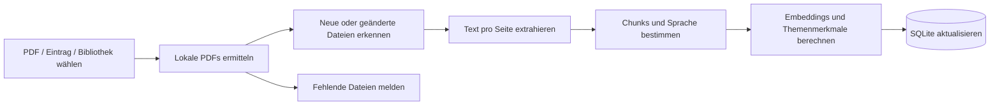
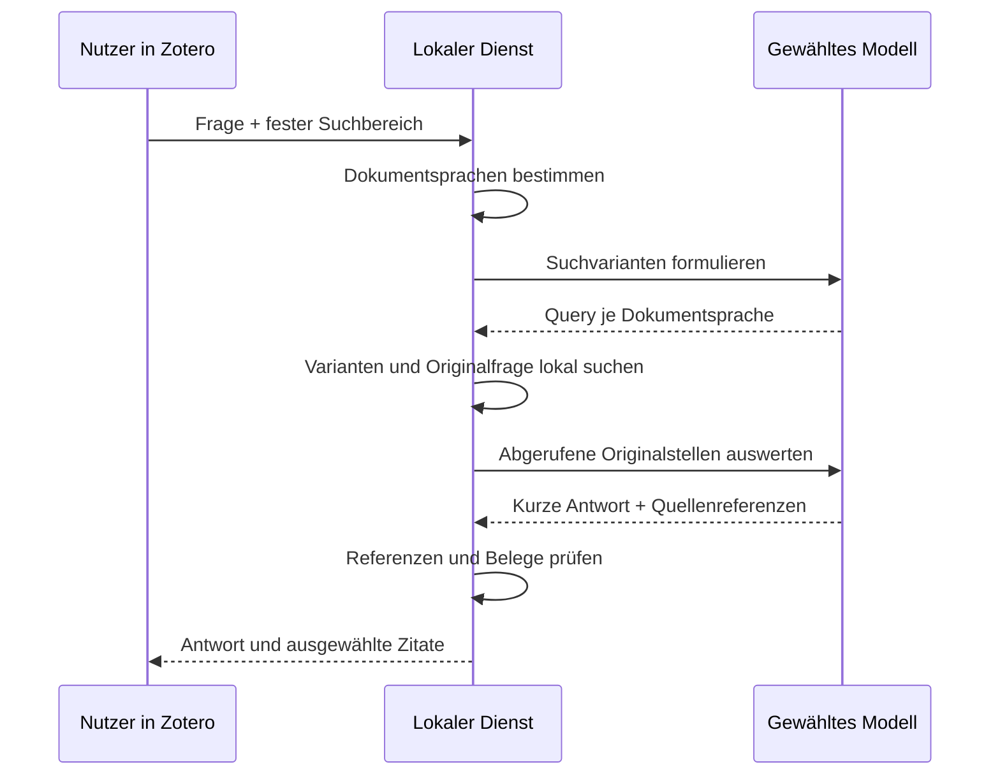
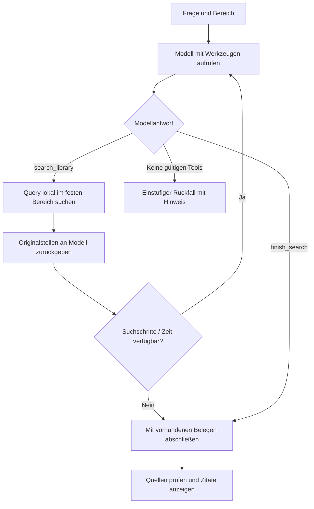
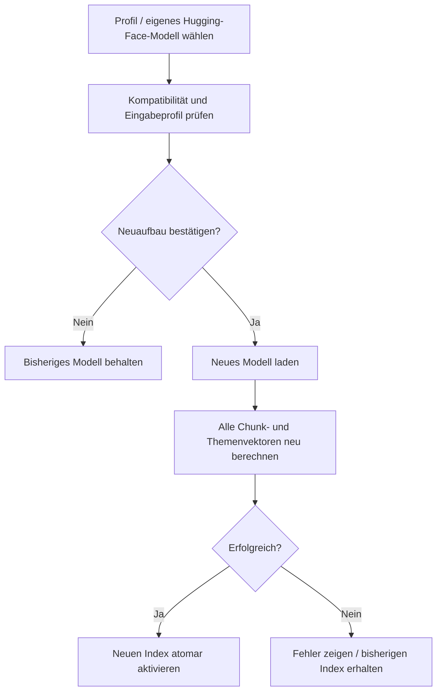

# Die einzelnen Abläufe

[Zur Projektseite](../README.md) · [Technische Architektur](ARCHITECTURE.md)

## 1. Neue PDF oder Bibliothek verarbeiten

**Eingabe:** ausgewählte Zotero-Bibliothek sowie PDF, Literatur-Eintrag oder Bibliotheksscan. **Ausgabe:** lokale Chunks, Vektoren, Metadaten und Fortschrittsbericht.

Bei einem Eintrag werden seine PDF-Anhänge verarbeitet. Bei einem Bibliotheksscan werden nur nicht aktuelle Anhänge neu indiziert. Neue PDF-Anhänge können über den Zotero-Notifier automatisch eingereiht werden. Nicht lokal verfügbare oder nicht auslesbare Dateien liefern einen Hinweis. Scans ohne Text brauchen vorher OCR.

## 2. Direkt suchen

**Eingabe:** Suchtext und Bibliotheks-/Sammlungsbereich.

1. Bereich validieren. Ist die gewählte Sammlung leer, mit leeren Ergebnissen abschließen.
2. Query mit dem aktiven lokalen Encoder berechnen.
3. Nur extrem unwahrscheinliche Dokumente grob ausschließen.
4. Alle verbliebenen Chunks mit Cosinus vergleichen.
5. Ähnliche Kandidaten mit BERTScore nachbewerten.
6. Wörtliche Sonderfälle und Relevanzregeln anwenden, Überschneidungen bereinigen.
7. Zitate mit Paper und PDF-Seite paginiert anzeigen.

**Ausgabe:** Originalstellen oder ein leeres Ergebnis. Es erfolgt kein KI-Anbieteraufruf. Beim Schließen bleiben Eingabe und Ergebnisse in der aktuellen Zotero-Sitzung erhalten.

## 3. Einstufige KI-Suche

**Eingabe:** natürliche Frage. **Ausgabe:** kurze Antwort und Quellenliste. Eine deutsche Frage kann damit englische Suchformulierungen für englische PDFs erhalten.

Die Originalfrage bleibt als Suchvariante erhalten. Die KI erhält eine begrenzte Auswahl der abgerufenen Stellen, kein vollständiges automatisches Lesen der gesamten Bibliothek. Wenn sie keine ausreichenden Belege erkennt, bleiben keine Zitate als ausgewählt stehen. Bei einem Anbieterfehler wird ein Hinweis gezeigt und gegebenenfalls die strengere lokale Suche verwendet.

## 4. Mehrstufige KI-Suche

Das Modell entscheidet, ob es eine zusätzliche Formulierung braucht. Der Dienst kontrolliert Suchbereich, Schrittzahl und Quellenkennungen. Wiederholte identische Abfragen innerhalb der Frage werden wiederverwendet. Die Aktivitätsanzeige kann die tatsächlichen Ereignisse sichtbar machen.

**Abbruch:** Reset oder Wechsel des Bereichs beendet die aktive UI-Anfrage; verspätete Ergebnisse werden verworfen. Das Zeitbudget kann eine schon laufende lokale Rechenphase nicht in jeder Situation sofort unterbrechen.

## 5. Eine Aussage mit Pro und Kontra prüfen

**Eingabe:** eine konkrete Aussage, beispielsweise „Kleinere Bild-Patches verbessern die Repräsentationsqualität ohne zusätzlichen Rechenaufwand.“ Dieses Beispiel ist eine Eingabeillustration, keine vorab garantierte Testfrage.

1. Unterstützende, widersprechende und relevante Teilaspekte der Aussage suchen.
2. Bei aktivierter und unterstützter mehrstufiger Suche zusätzliche Queries zulassen.
3. Alle im Ablauf abgerufenen Kandidaten in begrenzten Gruppen bewerten lassen.
4. Quellenreferenzen prüfen; Pro, Kontra und neutral/unklar zuordnen.
5. Befund, Begründung und Originalzitate mit Paper-Verweisen anzeigen.
6. Pro-/Kontra-Anteile berechnen: `Pro / (Pro + Kontra)` und `Kontra / (Pro + Kontra)`. Neutrale Stellen separat anzeigen.

**Ausgabe:** eine Gegenüberstellung der gefundenen Stellen. Ohne ausreichende gerichtete Belege gibt es keine aussagekräftige Rot-Grün-Bilanz. Die Suche kann Belege übersehen und bewertet keine Studienqualität.

## 6. Dokumentgrafik zur aktuellen Frage

1. Aktuelle Frage und vorhandene sprachbezogene Queries übernehmen.
2. Alle Chunks der verarbeiteten Dokumente im selben Bereich vergleichen.
3. Je Dokument den höchsten Cosinus-Wert wählen.
4. Identischen indizierten Inhalt zusammenfassen.
5. Die beobachtete Spanne in relative Gruppen einteilen.
6. Ringdiagramm, Dokumentanzahl und Liste mit bester PDF-Seite anzeigen.

**Ausgabe:** eine Orientierung, welche Dokumente zur Frage ähnliche Stellen enthalten könnten. Die Gruppenprozentzahl beschreibt den Bibliotheksanteil innerhalb des verarbeiteten Suchbereichs. Sie beschreibt weder den individuellen Ähnlichkeitswert noch die Wahrscheinlichkeit einer passenden Antwort.

## 7. Zitat im PDF öffnen

**Auslöser:** Doppelklick auf den Zitattext oder **Im PDF öffnen**.

Der Plugin-Code ermittelt den Zotero-Anhang, öffnet dessen Reader, wartet auf Initialisierung und übergibt Seite und Textposition. Kann eine passende Position erkannt werden, wird sie vorübergehend hervorgehoben. Andernfalls wird die betreffende PDF-Seite geöffnet. Das erzeugt keine gespeicherte Zotero-Annotation.

## 8. Zitat speichern, notieren und kopieren

1. **Zitat speichern** wählen; Originalstelle, Literaturangaben und Seite werden lokal gespeichert.
2. Unter **Gespeicherte Zitate** die Bibliothek auswählen und Suchzeile verwenden.
3. Eine Notiz hinzufügen oder bearbeiten.
4. Zitat erneut im PDF öffnen oder im gewählten Zotero-Zitierstil kopieren.
5. Bei Bedarf das gespeicherte Zitat entfernen.

Gespeicherte Zitate überleben Reset, Schließen und Zotero-Neustart. Der Kopiertext besteht aus Originaltext und formatiertem Kurzbeleg mit PDF-Seitenlocator.

## 9. Embedding-Modell wechseln

Der Neuaufbau betrifft **alle gespeicherten Bibliotheken**. Gespeicherte Zitate und Notizen bleiben bestehen. Modellgewichte und neue Vektoren benötigen zusätzlichen Platz. Ein Encoder muss zum Query-Format und zu den Dokumentsprachen passen; bloßes Übersetzen einer Query behebt nicht jedes ungeeignete Modell.

## 10. KI-Verbindung und Modellliste

1. Anbieter auswählen.
2. Bei Cloud-Anbietern Schlüssel eingeben; bei Ollama lokalen Server verwenden.
3. Modellliste aktualisieren und Modell wählen oder Kennung manuell eintragen.
4. Verbindung speichern; Schlüssel geht in den OS-Anmeldeinformationsspeicher.
5. Verbindung testen. Cloud-Tests können API-Kosten verursachen.
6. Mehrstufige Suche und Aktivitätsanzeige separat in den Einstellungen wählen.

Ein Katalogeintrag beweist nicht die Tool-Unterstützung. Scheitert die mehrstufige Verwendung, wird dies angezeigt und ein Rückfall versucht.

## 11. Fenster schließen, erneut öffnen und zurücksetzen

- **Schließen:** Chat, direkte Suche, Entwürfe und bereits angezeigte Ergebnisse pro Bibliothek erhalten.
- **Erneut öffnen:** diesen Sitzungszustand wiederherstellen.
- **Reset:** nur die betreffende Ansicht der aktuellen Bibliothek leeren und alte Antworten verwerfen.
- **Zotero neu starten:** temporäre Chat- und Direktansichten aller Bibliotheken leeren.
- **Gespeicherte Zitate:** in allen Fällen dauerhaft in der lokalen Datenbank erhalten.

## 12. Windows-Start und Dienstfehler

Nach Anmeldung soll die Windows-Aufgabe den Launcher starten. Öffnen des Zotero-Menüs kann ihn bei fehlendem Dienst ebenfalls direkt starten. Der Launcher nimmt eine Betriebssystem-Sperre und überwacht den Worker. Ein Worker-Absturz löst einen erneuten Start aus.

**Offener Fehlerfall:** Gehen Supervisor und Worker vollständig verloren, wurde durch Windows in den letzten Tests kein automatischer Wiederanlauf innerhalb von 100 Sekunden beobachtet. Den Dienst über das Menü oder das Startskript erneut starten. Ein zusätzlicher unabhängiger Wiederanlaufmechanismus ist noch zu implementieren und zu testen.
